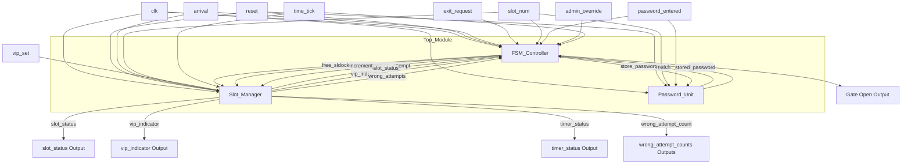
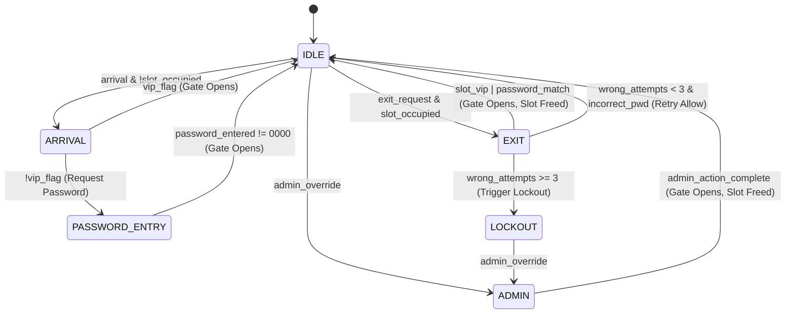

# 🚗 Smart Car Parking System (Verilog HDL)

The **Smart Car Parking System** is a high-performance, robust hardware controller designed in Verilog HDL and implemented on FPGA architecture to address the challenging demands of modern urban parking resource management. Modern traffic infrastructures require automated, secure, and highly efficient parking systems to optimize space allocation, reduce search times, and improve overall user experiences. This project provides a complete digital design solution, engineered and verified using Xilinx Vivado for synthesis, implementation, and behavioral simulation. The resulting Verilog code is fully optimized for FPGA hardware deployment.

At the core of the system is a 6-state Finite State Machine (FSM) that dictates the arrival, entry, parking duration, verification, lockout, and exit cycles of vehicles. The system handles four independent parking slots, each tracked by a dedicated slot management sub-system. Regular users register a slot-specific 4-bit password during arrival. To exit, the driver must input the correct password, preventing vehicle theft and unauthorized departures. To safeguard against brute-force password cracking attempts, the controller incorporates a lockout mechanism. If three consecutive incorrect password entry attempts are detected on a single slot, the system locks the slot and disables standard user exit controls. A locked slot can only be released through a manual administrative override, ensuring high-grade perimeter security.

For premium or emergency parking requirements, the system implements a VIP entry and exit feature. Setting the VIP signal during arrival configures the corresponding slot as VIP, enabling instantaneous gate activation without requiring password entry or validation. Furthermore, to optimize slot turnover and prevent vehicles from hogging parking spaces indefinitely, the design integrates synchronous auto-release timers. Each occupied slot tracks time ticks, and if a vehicle remains parked beyond ten ticks, the system triggers an automatic release, clearing the slot and resetting the gate.

This modular digital system is partitioned into the main FSM controller, a slot manager, and a secure password memory module, all integrated under a unified top-level wrapper. Verification has been thoroughly conducted using a behavioral testbench that simulates real-world parking scenarios, ensuring correct operation across multiple edge cases such as concurrent arrivals, password validation failures, lockouts, administrative overrides, and timer-driven auto-clear events.


---

## 🌟 Key Features

*   **👥 Multi-Slot Capacity**: Supports up to 4 parking slots, tracking occupancy and security metrics individually.
*   **🔑 Secure Password Verification**: Individual 4-bit password storage per slot to authenticate exit requests.
*   **⭐ VIP Access Mode**: Permits immediate entry/exit for VIP vehicles by bypassing the password input flow.
*   **🛡️ Security Lockout**: Automatically locks a slot and triggers a lockout state after three consecutive incorrect password attempts.
*   **⏱️ Auto-Release Timers**: Frees up slots automatically if a vehicle remains parked beyond a set duration (10 time ticks).
*   **🔧 Administrative Override**: Allows administrators to clear lockouts, open the gate, and reset occupancy states manually.

---

## 📐 Architecture & Block Diagram

The system employs a modular architecture structured around `Top_Module.v` which connects the FSM Controller, Slot Manager, and Password Unit.



---

## 🔄 Finite State Machine (FSM)

The control logic runs on a 6-state FSM inside [FSM_Controller.v](file:///c:/Users/Pranav_J/Downloads/parking/parking.srcs/sources_1/new/FSM_Controller.v):



---

## 🔌 Input / Output Interface

The port declarations for the main system controller [Top_Module.v](file:///c:/Users/Pranav_J/Downloads/parking/parking.srcs/sources_1/new/Top_Module.v) are listed below:

| Port Name | Direction | Width | Description |
| :--- | :---: | :---: | :--- |
| `clk` | Input | 1-bit | Global System Clock |
| `reset` | Input | 1-bit | Active-High Asynchronous Reset |
| `arrival` | Input | 1-bit | Car Arrival Signal |
| `exit_request` | Input | 1-bit | Car Exit Request Signal |
| `slot_num` | Input | 2-bit | Selected Parking Slot (00, 01, 10, 11) |
| `password_entered` | Input | 4-bit | 4-bit password input |
| `vip_set` | Input | 1-bit | Designates selected slot as VIP during arrival |
| `admin_override` | Input | 1-bit | Admin signal to override lockout or manually clear slot |
| `time_tick` | Input | 1-bit | Clock tick for auto-release timer |
| `gate_open` | Output | 1-bit | Gate Control Signal (High = Open) |
| `slot_status` | Output | 4-bit | Occupancy status for all 4 slots (1 = Occupied) |
| `vip_indicator` | Output | 4-bit | VIP status indicator for all 4 slots |
| `wrong_attempt_count_X` | Output | 2-bit | Failed password attempts for slot X (0, 1, 2, 3) |
| `timer_status` | Output | 4-bit | Time counter status for currently active slots |

---

## 📁 Repository Structure

```text
Smart_car_parking/
├── .gitignore
├── README.md
├── parking.xpr                       # Vivado Project File
└── parking.srcs/                     # Vivado Source Files
    ├── sim_1/new/
    │   └── Top_Module_tb.v           # Complete Testbench Simulation
    ├── sources_1/
    │   ├── bd/design_1/              # Block Design (if applicable)
    │   └── new/
    │       ├── Top_Module.v          # Top-Level Module Wrapper
    │       ├── FSM_Controller.v      # Control FSM Module
    │       ├── Password_Unit.v       # Memory & Verification Unit
    │       └── Slot_Manager.v        # Occupancy & Timers Manager
    └── utils_1/imports/synth_1/
        └── Top_Module.dcp            # Synthesized Design Checkpoint
```

---

## 🧪 Simulation & Test Bench

The testbench [Top_Module_tb.v](file:///c:/Users/Pranav_J/Downloads/parking/parking.srcs/sim_1/new/Top_Module_tb.v) performs 5 distinct simulation tests to ensure code correctness:

1.  **Test 1: Normal User Flow**
    *   Car arrives at Slot 0 $\rightarrow$ Regular flow requests password $\rightarrow$ Entry password stored.
    *   Car requests exit $\rightarrow$ Correct password entered $\rightarrow$ Gate opens and slot clears.
2.  **Test 2: VIP User Flow**
    *   Slot 1 is marked as VIP $\rightarrow$ Car arrives $\rightarrow$ Gate opens immediately (no password prompt).
    *   Car requests exit $\rightarrow$ Gate opens immediately and slot clears.
3.  **Test 3: Wrong Password Lockout**
    *   Car arrives at Slot 2.
    *   Car attempts exit with incorrect passwords 3 consecutive times $\rightarrow$ System triggers lockout state.
    *   Subsequent attempts (even with correct password) are denied.
4.  **Test 4: Admin Override**
    *   Admin asserts `admin_override` on locked Slot 2 $\rightarrow$ Gate opens, slot is freed, and wrong attempt counters reset.
5.  **Test 5: Timer Auto-Release**
    *   Car arrives at Slot 3.
    *   Simulated `time_tick` signals are applied.
    *   After 10 time ticks, the slot is automatically released (car auto-released) and slot is freed.

---

## 🚀 How to Run in Vivado

1.  Clone this repository:
    ```bash
    git clone https://github.com/PJ-tech-dev/Smart_car_parking.git
    ```
2.  Open **Xilinx Vivado** (2020.1 or newer recommended).
3.  Click **Open Project** and select `parking.xpr`.
4.  To run simulation:
    *   Go to **Flow Navigator** $\rightarrow$ **Simulation** $\rightarrow$ **Run Simulation** $\rightarrow$ **Run Behavioral Simulation**.
    *   Observe the waveforms or the console output window (`Stdout`/Tcl Console) for detailed simulation logs tracking FSM state transitions and validation status.
5.  To synthesize or implement:
    *   Select `Top_Module` as the design root.
    *   Click **Run Synthesis** / **Run Implementation**.
